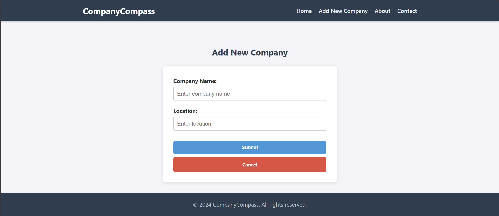

# CompanyCompass

## Table of Contents

- [Introduction](#introduction)
- [Features](#features)
- [Technologies Used](#technologies-used)
- [Project Structure](#project-structure)
- [Getting Started](#getting-started)
- [Screenshots](#screenshots)
- [Documentation](#documentation)

## Introduction

**CompanyCompass** is a web application for managing a directory of companies. It provides a clean interface to list,
create, update, and delete company profiles.

This project serves as a practical reference for Standard Spring Framework 6. Unlike typical Spring Boot apps, it
demonstrates how to manually configure the core architecture—including the DispatcherServlet, Security chains, and
Database connections—giving developers a deeper look into how Spring works under the hood.

## Features

- **CRUD Operations**: Full Create, Read, Update, and Delete functionality for company profiles.
- **Custom Styling**: A clean, responsive user interface built with custom CSS (no Bootstrap dependency).
- **Database Migrations**: Automated schema management using **Flyway**.
- **Security**: Configured using **Spring Security 6** with manual MVC request matching.
- **Templating**: Server-side rendering using **Thymeleaf**.

## Technologies Used

- **Language**: Java 21 (LTS)
- **Framework**: Spring Framework 6 (Spring MVC, Spring Data JPA)
- **Build Tool**: Gradle 8+
- **Database**: H2 (Embedded)
- **Security**: Spring Security 6.2
- **Frontend**: Thymeleaf & Custom CSS
- **Testing**: JUnit 5 & Spring Test

## Project Structure

```text
The project follows a standard Gradle structure:
src/main
├── java/com/example/companycompass
│ ├── config            # Spring & Security Configurations
│ ├── controller        # Web Controllers
│ ├── model             # JPA Entities
│ ├── repository        # Data Repositories
│ └── service           # Business Logic
└── resources
├── static              # CSS, JS, Images
├── templates           # Thymeleaf HTML views
└── db/migration        # Flyway SQL scripts
```

## Getting Started

### Prerequisites

- **Java 21 SDK** installed.
- **Gradle** (optional, as the wrapper is included).

### Installation & Running

1. **Clone the repository**
   ```bash
   git clone https://github.com/garikcareer/company-compass.git
   ```
   **Go into the company-compass directory**
   ```bash
   cd company-compass
   ```

2. **Build the project**

   Use the Gradle wrapper to build the project
   ```bash
   ./gradlew clean build
   ```

3. **Run the application**
   You can run the application using the Gradle's run task
   ```bash
   ./gradlew run
   ```

*Note: If running from IntelliJ IDEA, simply run the ``` CompanyCompassApplication ``` main class.*

4. **Access the App**
   Open your browser and navigate to: ``` http://localhost:8080 ```

## Screenshots
### CompanyCompass Homepage

### CompanyCompass View Companies Page


## Documentation

This project automatically generates standard Javadoc during the build. To view the documentation
after the build succeeds, open the generated HTML file in your browser:

```bash
start build/docs/javadoc/index.html
```